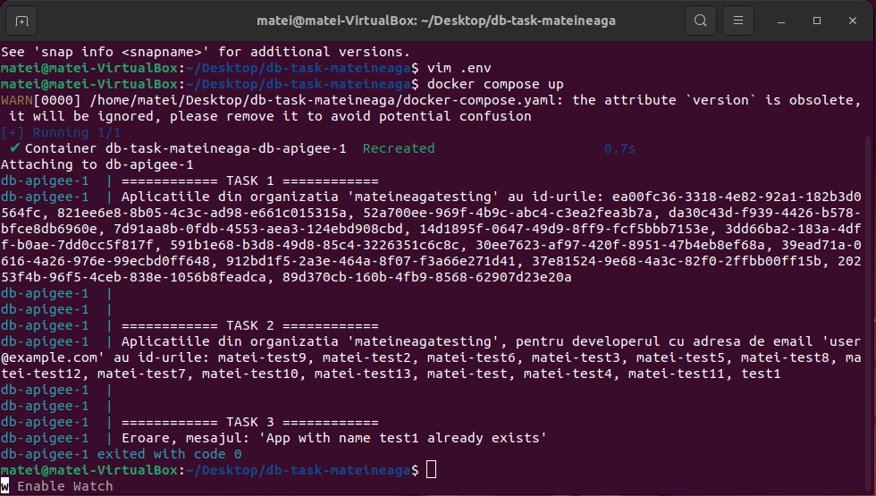

# db-task-mateineaga

Dupa cum este cerut, programul "script.py" returneaza toate aplicatiile dintr-o anumita organizatie, toate aplicatiile unui developer dintr-o anumita organizatie, si de asemenea, creeaza o aplicatie, desigur in cadrul unei organizatii pentru un anumit developer.

Asadar, pentru a rula cu succes scriptul, trebuie modificat fisierul ".env", care constituie variabilele de environment, fiind necesara o structura de forma:

```
ORG_NAME=x 
DEVELOPER_EMAIL=y
APP_NAME=z
AUTH_TOKEN=k
```

Inainte de a rula scriptul este necesara autentificarea pe GCP prin comanda "gcloud auth". Pentru a obtine tokenul de autentificare, se va rula comanda "gcloud auth print-access-token". Tokenul expira dupa 1h.

Codul trateaza si cazurile in care organizatiile, developerii sau taskul nu pot fi accesate/create cu mesaje sugestive.

------------------ BONUS: DOCKER ---------------------

Scriptul a fost impachetat intr-o imagine de docker, prin comanda 'docker build -t db-apigee -f Dockerfile .' In fisierul 'Dockerfile' se poate gasi structura cu care am realizat lansarea scriptului in containerul de Docker. Aceasta poate fi accesata prin comanda 'docker pull mateineaga10/db-apigee:latest'. 

Pentru a testa functionalitatea imaginii, am adaugat un file 'docker-compose.yaml'. Prin comanda 'docker compose up', va fi lansat un container Docker care contine script-ul, dar fara fisierul ".env". File-ul specific variabilelor si docker compose trebuie sa fie in acelasi director, pentru a functiona comanda 'docker compose up', deoarece primeste mount prin configuratiile fisierului "docker compose".


